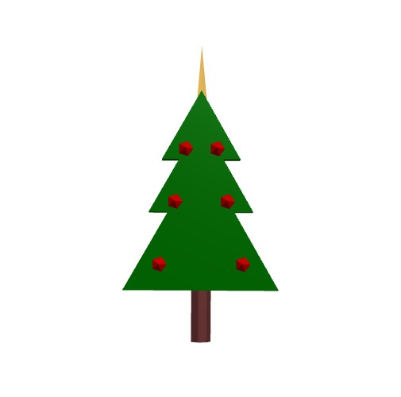

# Kerstboom met BlocksCAD

In deze opdracht gaan we een 3D kerstboom ontwerpen in BlocksCAD.

Voor het ontwerpen van 3D objecten ga je in een browser naar <a href="https://www.blockscad3d.com/editor/" target="_blank">BlocksCAD</a>.

Als je nog niet eerder met BlocksCAD hebt gewerkt, dan is het misschien verstandig om eerst een van de opdrachten te doen die bedacht zijn door de [Raspberry Pi Foundation](https://coderdojo-leiden.nl/3d-printen).

## Inhoud

1. De takken van de kerstboom
2. De stam van de kerstboom
3. Geschikt maken voor een 3D printer
4. Zet een piek op de kerstboom
5. Hang ballen aan de kerstboom
6. Uitdaging: Voeg meer versiering toe

[Naar de eerste stap >>](stap_1.md)

 Dit werk valt onder een <a rel="license" href="http://creativecommons.org/licenses/by-nc-sa/4.0/deed.nl">Creative Commons Naamsvermelding-NietCommercieel-GelijkDelen 4.0 Internationaal-licentie</a>.
