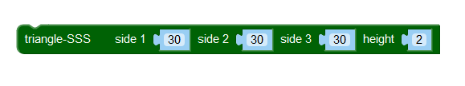
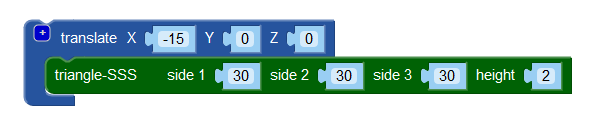
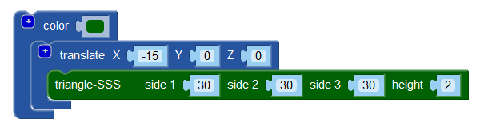
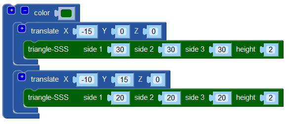
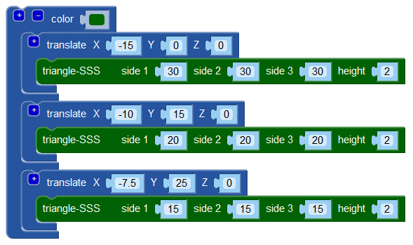

# De takken van de kerstboom

Open eerst de <a href="https://www.blockscad3d.com/editor/" target="_blank">BlocksCAD editor</a>, als je dat nog niet gedaan hebt.

Aan de linkerkant van het scherm vind je de groepen met blokken waarmee je allerlei 3D objecten kunt bouwen. Wij gaan vooral gebruik maken van de groepen 3D Shapes (3D vormen), Transforms (transformaties of veranderingen), Set Ops (verzameloperaties) en Experimental (experimenteel).
In het midden vind je het werkveld waar je blokken naar toe sleept om 3D objecten te bouwen. Net zoals in Scratch klik je blokken aan elkaar om je programma's te maken.
Aan de rechterkant vind je een voorbeeld van hoe je 3D object eruit gaat zien. Je ziet hier ook de drie assen van een 3D ruimte: de X-as (rood), de Y-as (groen) en de Z-as (blauw). Klik op de knop **Render** als je je code hebt veranderd; dan wordt je 3D object opnieuw getekend.

De takken van de kerstboom (met naalden, uiteraard) gaan we maken met driehoeken. In de groep Experimental vind je drie soorten driehoeken. Wij gaan een `triangle-SSS` gebruiken. Dat is een driehoek waarvan je de lengte van iedere zijde opgeeft. Sleep een `triangle-SSS` blok naar het werkveld. Geef side 1 (zijde 1), side 2 en side 3 de waarde 30 en height (hoogte) de waarde 2.

Druk op **Render**. Er verschijnt nu een driehoek. Met de linkerknop van de muis ingedrukt kun je het voorbeeld draaien en kantelen, en met het muiswiel (of de **+** en **-** knoppen) kun je in- en uitzoomen. Draai, kantel en zoom het voorbeeld nu zo dat je de driehoek van bovenaf ziet, de rode as (X-as) ongeveer horizontaal is en de groene as (Y-as) ongeveer verticaal. De blauwe as (Z-as) wijst naar je toe.

We willen dat het midden de zijde van de driehoek die op de X-as (rood) ligt samenvalt met het punt waar de Y-as (groen) begint, omdat dat het rekenwerk in het vervolg van deze opdracht iets makkelijker maakt. Daarvoor moet de driehoek 15 (de helft van de lengte van deze zijde van de driehoek) naar links geschoven worden.
Sleep uit de groep Transforms een `translate` (verplaats) blok naar je werkveld en klik deze op de `triangle-SSS`. Stel de X van de `translate` in op -15; de Y en Z blijven 0.

Druk op **Render**. De driehoek zou nu naar links geschoven moeten zijn.

We gaan nu de takken een mooie kleur geven. Sleep uit de groep Transforms een `color` (kleur) blok en klik deze op je `translate` blok. Kies een mooie kleur uit.

Druk op **Render**. De driehoek zou nu de door jouw gekozen kleur moeten hebben.

Tijd voor wat meer takken. Klik met de rechtermuisknop op je `translate` blok en kies Duplicate (kopieer). Je krijgt nu een tweede `translate` blok met daarin ook een `triangle-SSS` blok. Druk op **Render**.
Je nieuwe driehoek wordt over je eerste driehoek getekend, maar heeft niet de juiste grootte, positie en kleur! Maak de nieuwe driehoek eerst wat kleiner, bijvoorbeeld door alle zijden 20 te maken. Druk op **Render**.
Verplaats de driehoek nu, bijvoorbeeld met X = -10 en Y = 15. Druk op **Render**.
Nu willen we de tweede driehoek nog de juiste kleur geven. Daarvoor kan deze worden toegevoegd aan het `color` blok dat je al hebt. Klik op het `+` teken in de linkerbovenhoek van het `color` blok. Het `color` blok krijgt nu een extra opening waarin je de blokken van je nieuwe driehoek kunt klikken. Druk op **Render**.

Herhaal de stappen die je voor de tweede driehoek hebt gedaan om een derde driehoek toe te voegen. Maak deze driehoek nog wat kleiner, bijvoorbeeld door alle zijden 15 te maken, en verplaats de driehoek met X = -7.5 en Y = 25. Druk op **Render**.

[De volgende stap >>](stap_2.md)

 Dit werk valt onder een <a rel="license" href="http://creativecommons.org/licenses/by-nc-sa/4.0/deed.nl">Creative Commons Naamsvermelding-NietCommercieel-GelijkDelen 4.0 Internationaal-licentie</a>.
