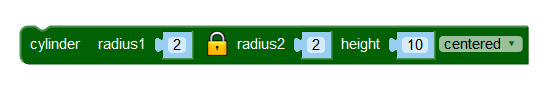
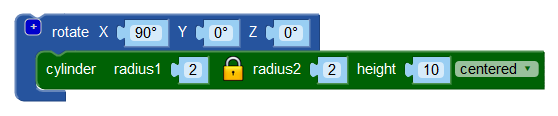

# De stam van de kerstboom

Laten we eerst zorgen dat je je project niet kwijt raakt. Geef je project een naam. Bijvoorbeeld kerstboom. Vul die naam in in het vak achter Project Name (projectnaam).

Sla nu je project op door op **Project** te klikken en dan **Save Blocks to your Computer** (sla blokken op op je computer) te kiezen.

Sla nu het bestand met de naam kerstboom.xml op. Als je later verder wilt gaan met je ontwerp, dan kies je **Load Blocks from your Computer** (laad blokken van je computer) uit het **Project** menu en kies je het bestand met de meest recente versie van je project.\
Vergeet niet je project regelmatig op te slaan. Dan kun je altijd terug naar een vorige versie en kun je op ieder moment stoppen.

Tijd om de kerstboom een stam te geven. Sleep uit de 3D Object groep een `cylinder` (cilinder) blok naar het werkveld. Stel radius1 (straal 1) in op 2 en height in op 10. Zoals je ziet wordt radius2 automatisch 2. Dat komt doordat het slotje gesloten is. Als het slotje open is, dan kun je radius1 en radius2 verschillende waarden geven. Verander not centered (niet gecentreerd) ook nog even in centered.

Druk op **Render**. Er verschijnt een cirkel aan de onderkant van de onderste takken. Als je het voorbeeld wat kantelt, zie je dat het inderdaad een cilinder is, maar dat deze niet de goede kant uit wijst voor een boomstam.\
We moeten de boomstam eerst draaien. Sleep daarvoor uit de Transforms groep een `rotate` (roteer of draai) blok en klik deze op je `cylinder` blok. Stel de X van de `rotate` in op 90 graden; de Y en Z blijven 0 graden.

Druk op **Render**. De stam zit nu voor de helft in de onderste takken. Dat kunnen we oplossen met een `translate` blok. Klik deze op het `rotate` blok en stel Y in op -5.

Druk op **Render**. Als laatste gebruiken we nog een `color` blok om de stam een goede kleur te geven.

Druk op **Render**. Je hebt nu als alles goed gegaan is een kerstboom met een nette stam eronder.\
Vergeet niet je project op te slaan!

[De volgende stap >>](stap_3.md)

 Dit werk valt onder een <a rel="license" href="http://creativecommons.org/licenses/by-nc-sa/4.0/deed.nl">Creative Commons Naamsvermelding-NietCommercieel-GelijkDelen 4.0 Internationaal-licentie</a>.
