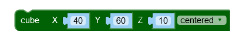
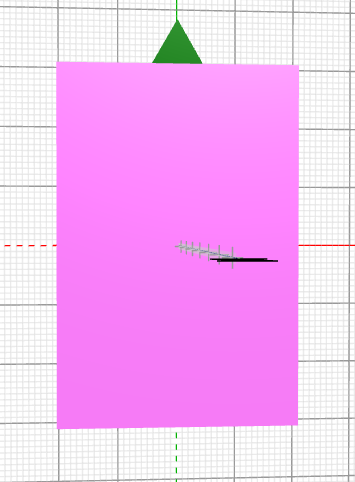
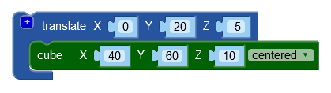
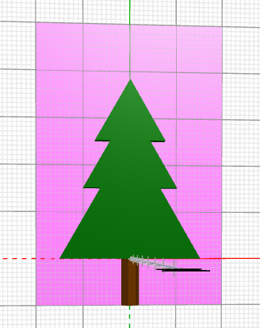
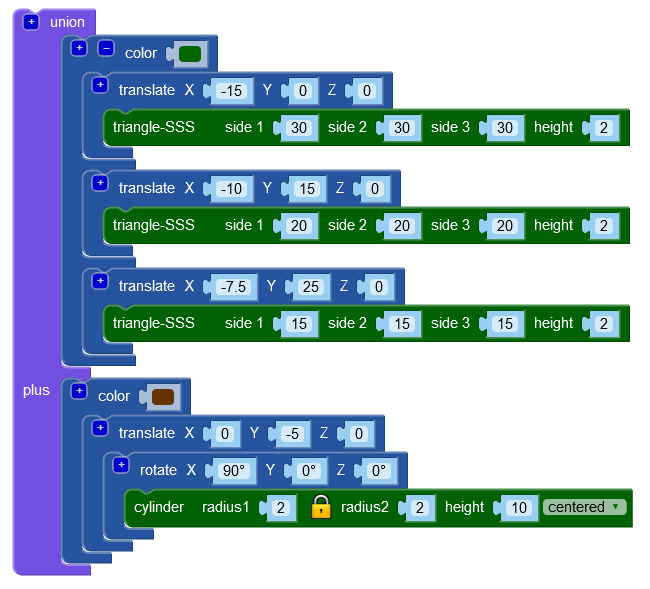
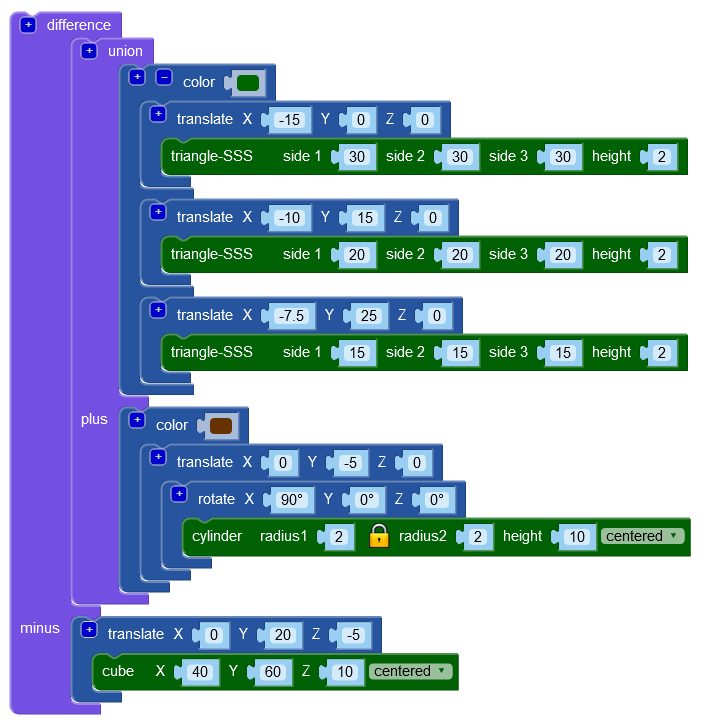

# Geschikt maken voor een 3D printer

Om je kerstboom goed door een 3D printer te kunnen laten printen, kan de onderkant het beste vlak zijn. Als je je kerstboom een beetje kantelt, dan zie je dat de achterkant van de stam lager zit dan de takken. Dat deel van de stam moeten we daarom wissen. Daarvoor gaan we het `difference` (verschil) blok uit de Transforms groep gebruiken.

Voor het te wissen deel gebruiken we een `cube` (kubus) blok uit de 3D Shapes groep. Sleep deze naar je werkveld. Stel X in op 40, Y op 60 en Z op 10. Maak de rechthoek ook centered.

Druk op **Render**.

Met een `translate` blok moet de rechthoek achter de takken gelegd worden. We schuiven de rechthoek ook wat naar boven zodat die helemaal achter de kerstboom ligt. Stel hiervoor de Y van het `translate` blok in op 20 en de Z op -5.

Druk op **Render**.

Voor we het `difference` blok kunnen gebruiken, gaan we eerst de takken en de stam van de kerstboom samenvoegen met een `union` (vereniging) blok uit de Set Ops groep. Klik de groep blokken voor de takken in de eerste opening van het `union` blok en de groep blokken voor de stam in de tweede opening. (Maar andersom werkt net zo goed.)

Pak nu een `difference` blok erbij. Klik het `union` blok met de hele kerstboom in de eerste opening en het groepje blokken met de rechthoek in de tweede opening. Hier is de volgorde wel belangrijk!

Druk op **Render**.\
De kerstboom ziet er weer net zo uit als eerst, maar als je je kerstboom weer een beetje kantelt, dan zie je nu dat de achterste helft van de stam is verdwenen.

## 3D printen

Nu zou je een eerste versie van je kerstboom kunnen printen op een 3D printer. Daarvoor druk je rechtsonder in het scherm op de knop **Generate STL** (genereer STL). Eventueel kies je eerst uit het lijstje links van deze knop het juiste bestandstype voor de 3D printer die je gaat gebruiken. Sla het bestand op op je computer en stuur het vervolgens naar de 3D printer.

[De volgende stap >>](stap_4.md)

 Dit werk valt onder een <a rel="license" href="http://creativecommons.org/licenses/by-nc-sa/4.0/deed.nl">Creative Commons Naamsvermelding-NietCommercieel-GelijkDelen 4.0 Internationaal-licentie</a>.
