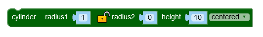
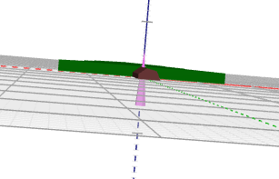
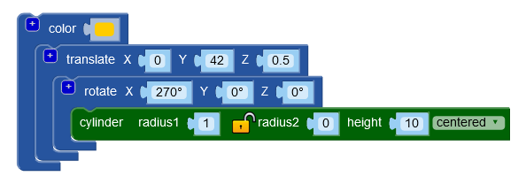
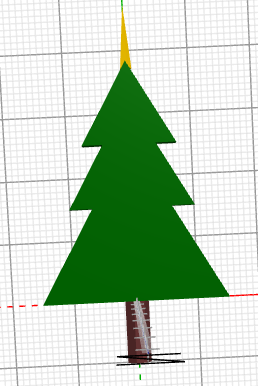
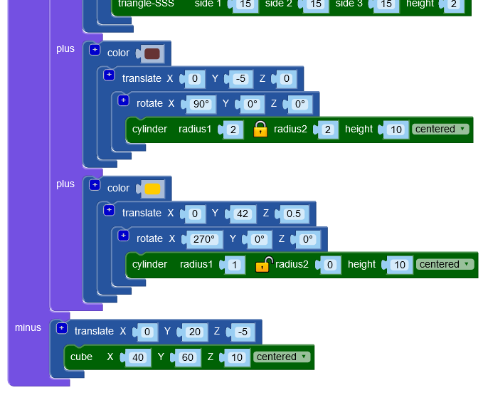

# Zet een piek op de kerstboom

Nu wordt het tijd om je kerstboom te versieren. Iedere goede kerstboom heeft natuurlijk een piek! Voor de piek gaan we, net als voor de stam, gebruik maken van een `cylinder`, alleen gaan we nu geen gewone cilinder gebruiken, maar laten we onze piek spits toelopen.\
Sleep een `cylinder` blok naar je werkveld. Stel radius1 in op 1, op het slotje, stel radius2 in op 0, height in op 10 en maak de piek centered.

Druk op **Render**.\
Waarschijnlijk zie je niets veranderen, want de piek wijst met zijn punt naar je toe. Kantel het beeld om je piek te bekijken.

Gebruik een `rotate` blok (X = 270 graden) en een `translate` blok (Y = 42 en Z = 0.5) om je piek op zijn plek te krijgen. Voeg nog een `color` blok toe om je piek een mooie kleur te geven.

Druk op **Render**.

Het laatste wat nog moet gebeuren is de piek toevoegen aan het `union` blok van de kerstboom. Klik hiervoor op de `+` linksboven in het union blok en sleep je piek naar de nieuwe opening in het `union` blok.

Vergeet niet je project op te slaan!

[De volgende stap >>](stap_5.md)

 Dit werk valt onder een <a rel="license" href="http://creativecommons.org/licenses/by-nc-sa/4.0/deed.nl">Creative Commons Naamsvermelding-NietCommercieel-GelijkDelen 4.0 Internationaal-licentie</a>.
