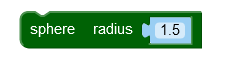
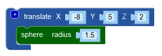
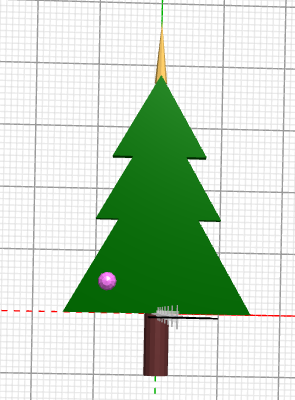
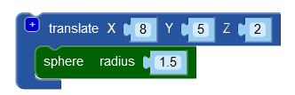
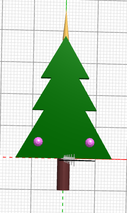
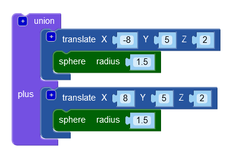
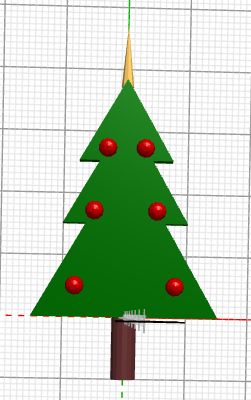

# Hang ballen aan de kerstboom

Wat is een kerstboom zonder ballen? We gaan ballen aan de kerstboom toevoegen door gebruik te maken van het `sphere` (bol) blok uit de 3D Objects groep. Sleep deze naar het werkveld en stel de radius (straal) in op 1.5

Druk op **Render**.\
Je ziet nog geen bal verschijnen, omdat de straal van de bal kleiner is dan de dikte van de kerstboom. Gebruik een `translate` blok om de bal een betere plek in de kerstboom te geven. Stel X in op -8, Y op 5 en Z op 2.

Druk op **Render**.

Laten we meteen een tweede bal toevoegen aan de rechterkant van de kerstboom. Kopieer de blokken van de eerst bal en verander in het `translate` blok van de kopie de X in 8.

Druk op **Render**.

Omdat we meer ballen aan de kerstboom willen hangen die in paren voorkomen, gaan de we twee ballen die we nu hebben bij elkaar zetten met een `union` blok.

Kopieer het `union` blok met de twee ballen en verander in de kopie de X in -5 (eerste bal) respectievelijk 5 (tweede bal) en de Y in 17 (beide ballen).\
Kopieer het `union` blok met de twee ballen nog een keer en verander in de kopie de X nu in -3 en 3 en de Y in 27.\
Gebruik nog een `color` blok om de drie paar ballen een mooie kleur te geven.

Druk op **Render**.

Voeg als laatste het `color` blok met alle ballen toe aan het `union` blok van je kerstboom.\
En vergeet niet je project op te slaan!

[De volgende stap >>](stap_6.md)

 Dit werk valt onder een <a rel="license" href="http://creativecommons.org/licenses/by-nc-sa/4.0/deed.nl">Creative Commons Naamsvermelding-NietCommercieel-GelijkDelen 4.0 Internationaal-licentie</a>.
